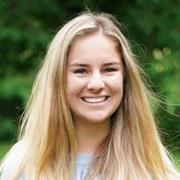
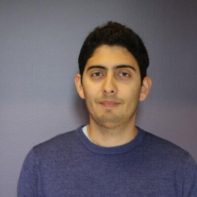
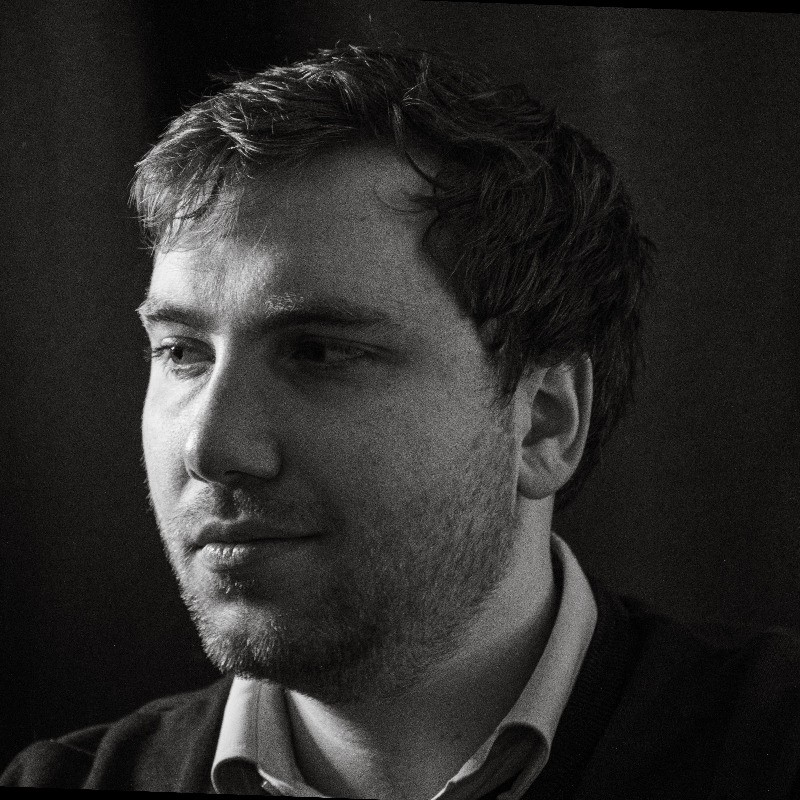
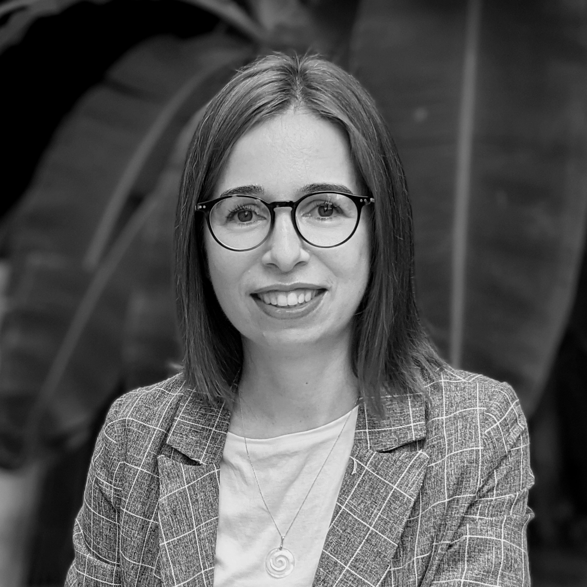
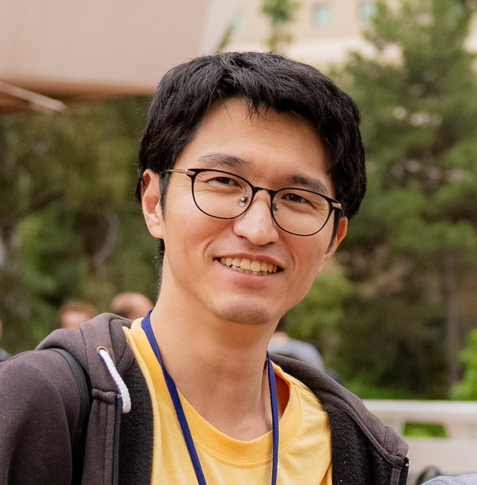
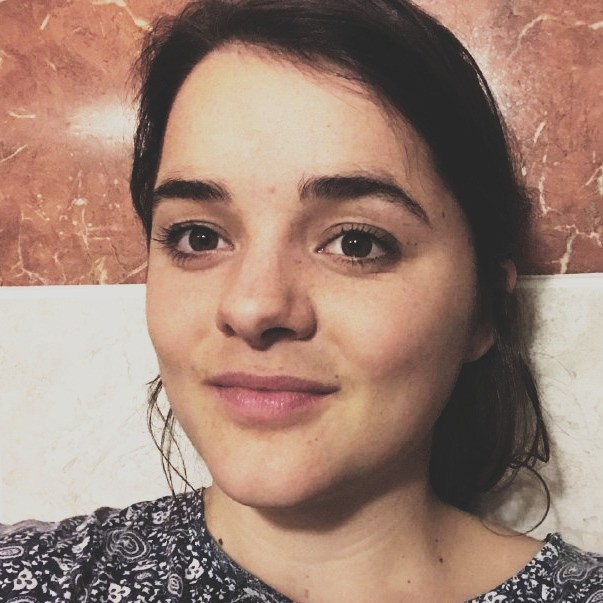
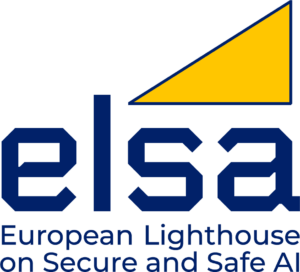
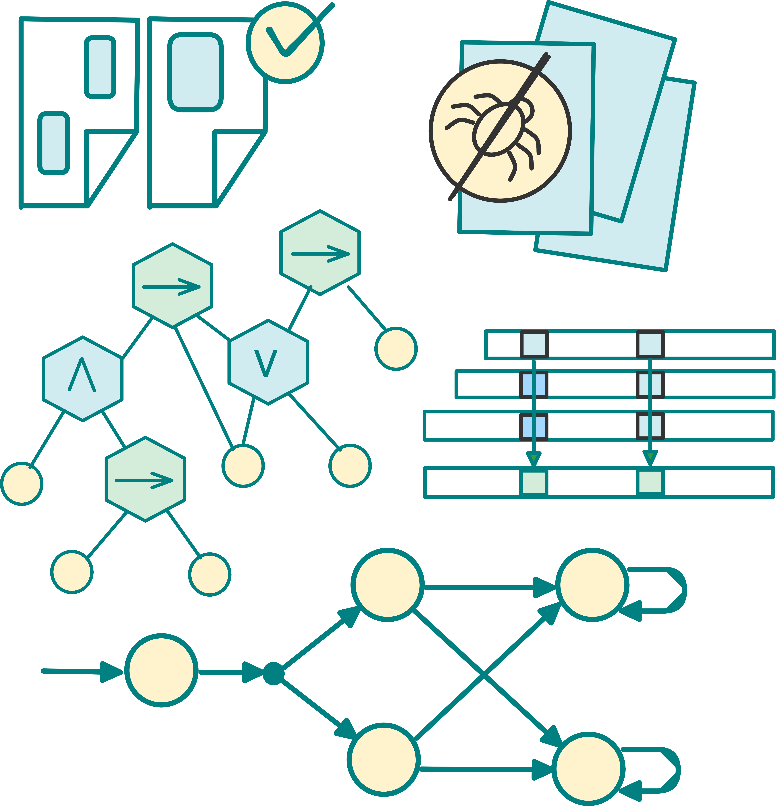

Formal reasoning about learning systems presents novel, challenging, and exciting problems, including but not limited to the verification of neural networks and the development of safeguards for machine learning algorithms. The Symposium on AI Verification brings together researchers from the fields of formal methods and artificial intelligence, providing a platform for the exchange of ideas and cross-pollination of insights on these critical areas.

SAIV 2025 will be co-located with the [37th International Conference on Computer Aided Verification](https://conferences.i-cav.org/2025/) in Zagreb, Croatia.

SAIV 2025 will host the [6th International Verification of Neural Networks Competition (VNN-COMP'25)](https://sites.google.com/view/vnn2025).

## Invited Speakers and Round Tables

<table>
  <tr>
    <td style="padding-right:16px;">
      
    </td>
    <td>
      <a href="https://profiles.imperial.ac.uk/e.giunchiglia" target="_blank"><b>Eleonora Giunchiglia</b></a> (Imperial-X, London, UK) 
      <em>Neuro-Symbolic and Generative AI</em>
    </td>
  </tr>
  <tr><td colspan="2" style="height:18px;"></td></tr>
  <tr>
    <td style="padding-right:16px;">
      
    </td>
    <td>
      <a href="https://gaperez64.github.io/" target="_blank"><b>Guillermo A. Pérez</b></a> (University of Antwerp, Belgium) 
      <em>Decidable Problems for Partially Observable MDPs</em>
    </td>
  </tr>
  <tr><td colspan="2" style="height:18px;"></td></tr>
  <tr>
    <td style="padding-right:16px;">
      
    </td>
    <td>
      <a href="http://www.arnaboldiluca.eu/" target="_blank"><b>Luca Arnaboldi</b></a> (University of Birmingham, UK) 
      <em>Formal Methods for Natural Language Processing</em>
    </td>
  </tr>
  <tr><td colspan="2" style="height:18px;"></td></tr>
  <tr>
    <td style="padding-right:16px;">
      
    </td>
    <td>
      <a href="https://andrecostea.github.io" target="_blank"><b>Andreea Costea</b></a> (TU Delft, The Netherlands) 
      <em>Assured Automatic Programming via LLMs</em>
    </td>
  </tr>
  <tr><td colspan="2" style="height:18px;"></td></tr>
  <tr>
    <td style="padding-right:16px;">
      
    </td>
    <td>
      <a href="https://www.fos.kuis.kyoto-u.ac.jp/~mwaga/" target="_blank"><b>Masaki Waga</b></a> (Kyoto University, Japan) 
      <em>Soft Pattern Matching: Toward Runtime Verification of NLP Systems</em>
    </td>
  </tr>
  <tr><td colspan="2" style="height:18px;"></td></tr>
  <tr>
    <td style="padding-right:16px;">
      
    </td>
    <td>
      <a href="https://nora-ammann.replit.app/" target="_blank"><b>Nora Ammann</b></a> (Advanced Research and Invention Agency, UK) 
      <em>Safeguarded AI: Funding Opportunities</em>
    </td>
  </tr>
</table>

The travel of our invited speakers was made possible thanks to [The ELSA Mobility Program](https://elsa-ai.eu/overview/).

